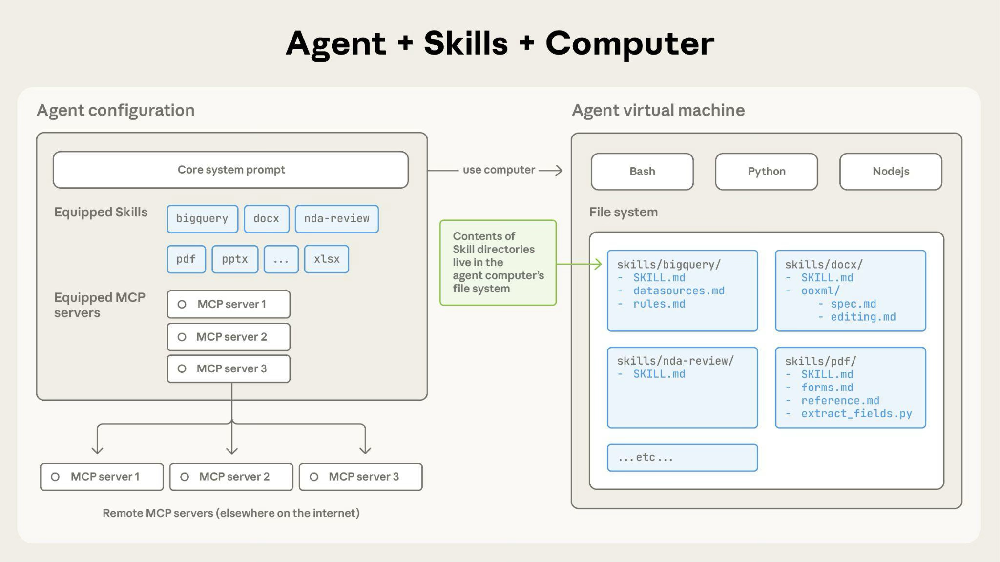
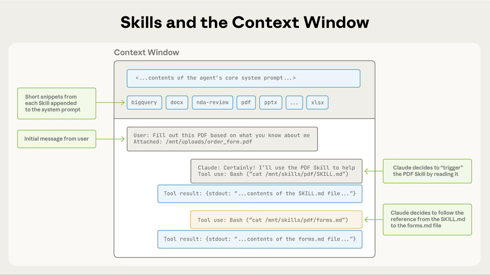

# Agent Skills 🚀
### Transforming General AI into Domain Specialists

<div class="pt-12">
  <span @click="$slidev.nav.next" class="px-4 py-1 rounded cursor-pointer hover:bg-white/10 transition" style="border: 1px solid rgba(255,255,255,0.2)">
    Press Space to start <carbon:arrow-right class="inline"/>
  </span>
</div>

<div class="abs-br m-6 flex gap-2">
  <button @click="$slidev.nav.prev" class="text-xl icon-btn opacity-50 !border-none hover:opacity-100">
    <carbon:chevron-left />
  </button>
  <button @click="$slidev.nav.next" class="text-xl icon-btn opacity-50 !border-none hover:opacity-100">
    <carbon:chevron-right />
  </button>
</div>

---
layout: intro
---

# The "Smartphone App" Concept

Think of AI as a brand-new smartphone. Out of the box, it can do basic tasks, but to unlock its full potential, you install **Apps**. 

**Agent Skills** do exactly that for AI:
- **Instant Expert**: Add specialized knowledge (PDF processing, Financial reporting, Web Scraping).
- **On-Demand Loading**: Only loads when you need it (saves memory/tokens).
- **Modular Ecosystem**: Build a library of "apps" to customize your agent for any workflow.
- **Repeatable**: Do the same task with the consistent results every time.

---
layout: default
---

# 🏗️ Core Structure: Progressive Disclosure

Skills use **Progressive Disclosure** to stay efficient.

| Level               | Content                                                               | Cost          | When Loaded?        | Purpose                   |
| :------------------ | :-------------------------------------------------------------------- | :------------ | :------------------ | :------------------------ |
| **1: Metadata**     | `name` & `description`                                                | ~ 100 tokens  | **Always**          | Discovery & triggering    |
| **2: Instructions** | `SKILL.md` body                                                       | < 5000 tokens | **On Trigger**      | Immediate workflows       |
| **3: Resources**    | Bundled files executed via bash without loading contents into context | Varies        | **When Referenced** | Deep dive & heavy lifting |

<br>

> [!TIP]
> Keep your metadata under 100 words and `SKILL.md` under 500 lines for maximum speed!

---
layout: default
---

# File Structure Example

Skills are essentially "Mini Virtual Machines" packaged cleanly in a directory structure. 

```text
my-validation-skill/
├── SKILL.md            # Main logic & instructions
├── scripts/
│   └── validate.py     # Heavy lifting (runs in bash, not context)
├── references/
│   └── database-schema.md # Large documentation (Level 3 loading)
└── assets/
    └── report-template.html
```

> **Why Scripts?** Scripts run in the VM's bash environment. They return *results*, not the whole code, saving thousands of context tokens!

---
layout: default
---

# SKILL.md Structure
Required fields: name and description

```md
---
name: your-skill-name
description: Brief description of what this Skill does and when to use it
---

# Your Skill Name

## Instructions
[Clear, step-by-step guidance for Claude to follow]

## Examples
[Concrete examples of using this Skill]
```

<div class="text-xs">

<div class="grid grid-cols-2 gap-4">
<div>

#### name:
- Max 64 characters
- Lowercase, numbers, hyphens only
- No XML tags
- No reserved words ("anthropic", "claude")

</div>
<div>

#### description:
- Must be non-empty
- Maximum 1024 characters
- No XML tags
- Should include **what** it does + **when** to use it

</div>
</div>

</div>

---
layout: default
class: px-10
---

# The Skills Architecture

<div class="grid grid-cols-2 gap-4">
<div>

Skills run in a secure execution environment with full filesystem and code capabilities.

- **Dynamic Loading:** When triggered, Claude runs `bash` to read the `SKILL.md` file, injecting rules straight into its context buffer.
- **Efficient Scripts:** When the AI needs to check facts or run math, it natively fires off your scripts. The *code of the script* never pollutes the context space. Only the output does.
- **Zero-Penalty Bundling:** Bundle as many heavy docs as you want. They only cost tokens if the agent proactively opens them.

</div>



</div>

---
layout: default
---

# Example: Loading a PDF Skill

<div class="grid grid-cols-2 gap-4">
<div>

**User Prompt:**  
> *"Extract the text from this PDF and summarize it."*

**Under the Hood Loop:**
1. **Model recognizes intent** from pre-loaded Level 1 Metadata.
2. **Claude invokes bash** to read `pdf-skill/SKILL.md` instructions.
3. Claude decides if extra documents (like `FORMS.md` mentioned in the skill) are needed. If not, it skips them to save tokens.
4. Claude natively executes a bundled Python script to parse the PDF.

</div>


</div>

---
layout: default
---

# 🌍 One Skill, Every AI
### The Open Standard

Initially created by Anthropic, the filesystem-based skill approach is an **Open Standard** supported across tools:

- **Anthropic**: Claude.ai, Claude Code, API
- **OpenAI**: ChatGPT, Codex CLI
- **Google**: Gemini CLI
- **Microsoft**: GitHub Copilot

> **Write Once, Run Anywhere.** Your specialized workflows are no longer locked into one platform.

---
layout: section
---

# 🛠️ Step-by-Step Guide
### How to Build and Deploy a Skill

---
layout: default
---

# Step 0: The Problem - Context Limits 

Why build a skill in the first place? Imagine you need an AI to check CSV files frequently.

**Without a Skill (Heavy Prompting):**
- **User Prompt:** "Here are 5 pages of database schema, 10 rules for data entry, and my python validation code. Now please check this CSV against them."
- **Token Usage:** `15,000+ tokens` per request.
- **Result:** You flood the context window, leaving less room for logic. Costs scale linearly per request!

**With a Custom Skill:**
- **User Prompt:** "Validate this CSV."
- **Token Usage:** `~50 tokens` (AI just runs your `validate.py` script!)
- **Result:** Massive token savings, perfect deterministic execution, and lower latency.

---
layout: default
---

# Step 1: Prepare the "Skill Creator"

To build a skill efficiently, we use Claude's own `skill-creator` tool and a resource file.

**The Setup:**
1. **Tool:** Install the official Skill Creator.
   ```bash
   /plugin install skill-creator@claude-plugins-official
   ```
2. **Resource:** We have prepared `demo/server.log` (dummy data) and `demo/log-rules.md` (instructions).
3. **VM Environment:** Ensure your Agent has access to a bash/code-execution environment.

---
layout: default
---

# Step 2: Draft the Problem Statement

We'll use a specific prompt to trigger the `skill-creator`. Copy this code block into the Agent's chat box:

```text
/skill-creator Create a "log-analyzer" skill for me.
The skill should help me parse server logs and find critical errors.
Please include a Python script in the scripts/ folder to read the log 
file and only output ERROR lines, so long logs don't fill my context window.

Reference: Use `demo/log-rules.md` for the logic on how to categorize errors.
```

---
layout: default
---

# Step 3: Test & Success! 🎉

Once the skill is generated and saved to your directory, let's test it on our dummy file.

**The Prompt:**
> "Use the log-analyzer skill to check `demo/server.log`."

**The Result:**
- **Status:** ✅ SUCCESS
- **Execution:** Claude runs the Python script to filter errors, then applies the `log-rules.md` formatting.
- **Efficiency:** The hundreds of `[INFO]` logs stay in the VM. Only the relevant errors consume tokens!

